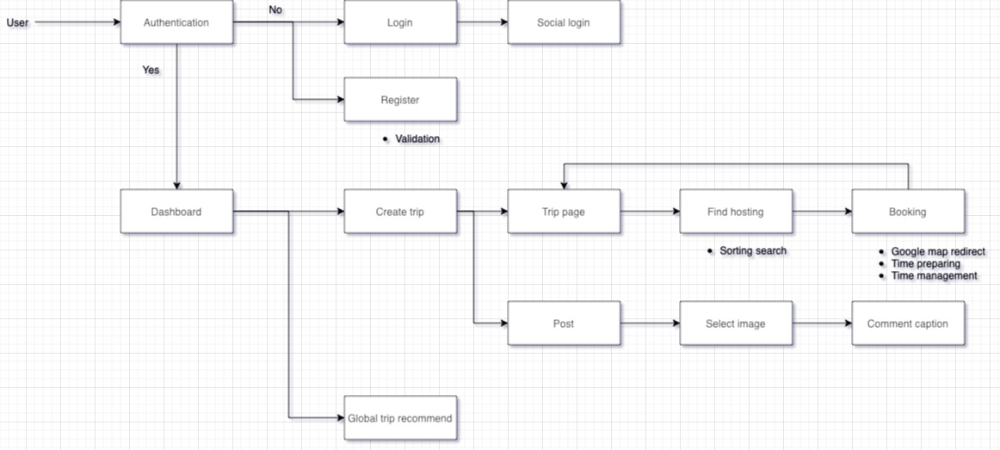

<h1>🏖 Friday </h1>

แอปพลิเคชันที่ช่วยผู้ใช้งานในการสร้างทริปการท่องเที่ยวให้ง่ายยิ่งขึ้น มาพร้อมกับหลากหลายฟีเจอร์ที่ช่วยให้ผู้มีความสะดวกในการใช้งาน และสร้างประสบการณ์ที่ดียิ่งขึ้น คุ้มค่า คุ้มเวลา ในทริปการท่องเที่ยวเหล่านั้น พร้อมทั้งสามารถร่วมแชร์ประสบการณ์ บอกเล่าความรู้สึก เหมือนสังคมออนไลน์สำหรับคนที่ชอบในการท่องเที่ยว หรือคนที่ชอบในการศึกษาประสบการณ์จากผู้อื่น

<h1>📚 Education </h1>
<h3>🔥 User flow design</h3>

<h3>🔥 Tech stack</h3>

| Front-End | Back-End | Database | 
| :---: | :---: | :---: | 
| Flutter | Node js | Firebase | 

| Test on device |
| :---: |
|APK build    </td>|

<h3>🔥 การทดลองใช้งาน</h3>

    git clone https://github.com/BlueBearrii/vr-love-friday.git
  
หรือ ดาวน์โหลดได้จาก Github 👍

#### สำหรับการใช้งาน Server 
คำสั่งสำหรับการทำงานของ Server
     
     npm run server

#### สำหรับการใช้งาน Client 
คำสั่งสำหรับการทำงานของ Client จะต้องใช้งาน Path folder: /friday และคำสั่ง

    flutter run
    
#### สำหรับการใช้งานแบบ local host
การใช้งานแบบ Local host จำเป็นที่จะต้องเปลี่ยน Root url ใน Project Friday ตาม Path: /friday/lib/apis/root.dart

    class MainRoot {
      static String root = "https://vr-love-friday.herokuapp.com/api";
      //static String root = "http://localhost:5000/api";
    }
    
<h3>🔥 API</h3>

Deploying : https://vr-love-friday.herokuapp.com/api

| Feature | Method  | Route | Parameters | Description |
| --- | :---: | --- | --- | --- |
| userInfo| POST | /auth/userInfo | uid | - |
| registration| POST | /auth/registration | email, uid, phone, displayName, user_image_path | - |
| uploadProfile| POST | /auth/uploadProfile | uid, file | - |
| | | | | |
| createHost| POST | /host/createHost | hostName, address, contact, coverUrl, uid, order, type, description, conditions | - |
| fetchHosting| POST | /host/fetchHosting | uid, type, lifstyle, keywords, balance | - |
| fetchAllHosting| POST | /host/fetchAllHosting | type, uid, searchName | - |
| uploadPhoto| POST | /host/uploadPhoto | uid, name, path, file | - |
| uploadPhotos| POST | /host/uploadPhotos | uid, path, files | - |
| | | | | |
| createTripRoom| POST | /trip/createTripRoom | uid, tripName, budget, days, destination, user_image_path | - |
| fetchTrips| POST | /trip/fetchTrips | uid | - |
| fetchingComments| POST | /trip/fetchingComments | tripId | - |
| fetchTrip| POST | /trip/fetchTrip | uid | - |
| fetchTripPublic| POST | /trip/fetchTripPublic | uid | - |
| fetchBooked| POST | /trip/fetchBooked | uid, tripId | - |
| loadBalance| POST | /trip/loadBalance | uid, tripId | - |
| updateBalance| POST | /trip/updateBalance | uid, tripId, pay | - |
| bookNow| POST | /trip/bookNow | uid, tripId, pay | - |
| post| POST | /trip/post | uid, tripId, comments, username, user_image_path, createdAt | - |
| likeTrip| POST | /trip/likeTrip | collection, tripId, uid | - |
| updateCover| POST | /trip/post | tripId, uid | - |

